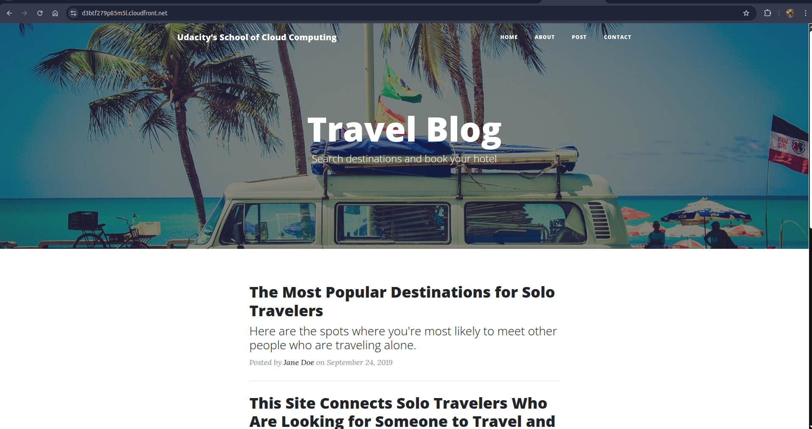

# Project: Deploy Static Website on AWS

Student Name: Abhishek Kumar

## Project Description:
This project demonstrates deployment of a static website using Amazon S3 and Amazon CloudFront.

### Steps Completed:
1. Created an S3 bucket.
2. Uploaded website files (HTML, CSS, JS, images).
3. Enabled static website hosting.
4. Configured bucket policy to allow public read access.
5. Created a CloudFront distribution using the S3 website endpoint as origin.
6. Verified website accessibility via S3 endpoint and CloudFront CDN URL.

#### S3 Website Endpoint:
[https://d3btf279p85m5l.cloudfront.net/](http://my-891181200060-project.s3-website-us-east-1.amazonaws.com/)

#### S3 object URL:
[https://d3btf279p85m5l.cloudfront.net/](http://my-891181200060-project.s3.amazonaws.com/index.html)

#### CloudFront URL:
[https://d3btf279p85m5l.cloudfront.net/](https://d3btf279p85m5l.cloudfront.net/)

##### The website is publicly accessible and functioning correctly.
